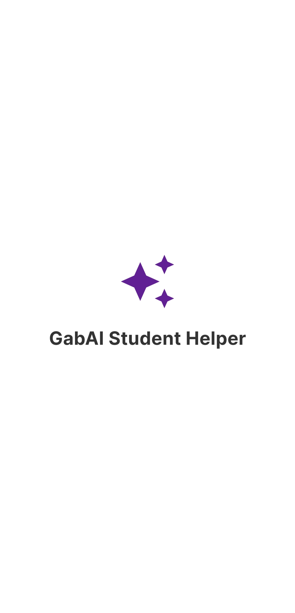
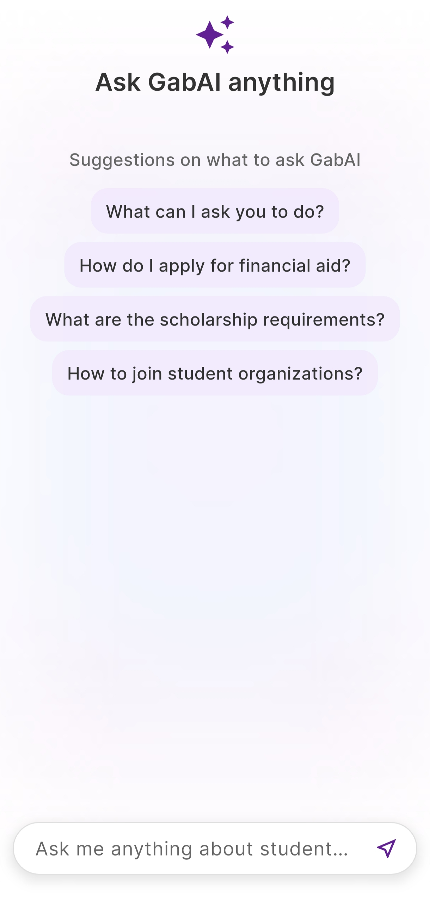
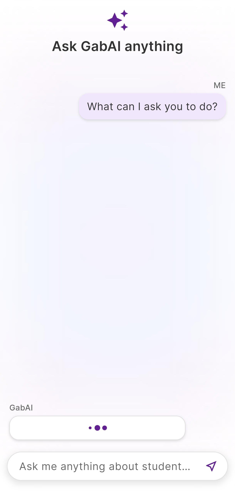
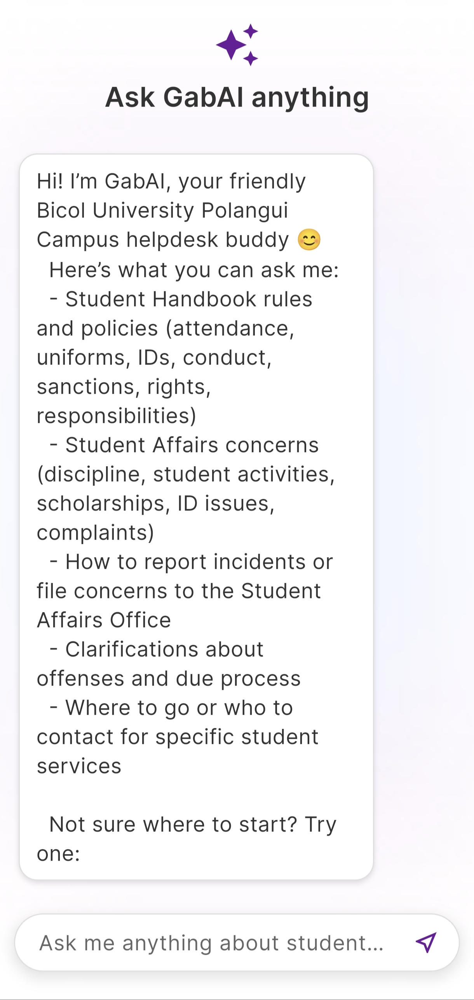

# BUddy: Smart Student Affairs Assistant


BUddy is a mobile-first, AI-powered chatbot designed to serve as a Smart Student Affairs Assistant for **Bicol University Polangui (BUP)**.

This project, developed using Flutter and Botpress, aims to solve common communication challenges by providing students with 24/7, instant access to information about university services, policies, and procedures.

## 🎯 The Problem

Students at Bicol University Polangui often experience significant delays and long queues when seeking assistance from the Office of Student Affairs and Services (OSAS). This is especially true during peak periods like enrollment and evaluation.

The reliance on in-person communication and limited office hours, combined with staff being overwhelmed by repetitive questions, leads to frustration and inefficiency.

## 💡 The Solution

**BUddy** provides a 24/7 online platform that instantly answers student questions, eliminating the need for many in-person visits.

By automating routine inquiries, the system enhances service accessibility for students and allows OSAS staff to focus on more complex administrative and developmental duties. This project aligns with Bicol University’s Thematic Area 2 (Industry, Energy, and Emerging Technology) and supports Sustainable Development Goal 4 (Quality Education).

## ✨ Features

- **Animated Splash Screen:** A smooth, welcoming animation on app launch.
- **Modern Chat UI:** A clean, intuitive, and readable chat interface.
- **Real-time Communication:** Uses HTTP polling for instant message delivery and receiving.
- **Bot Typing Indicator:** Shows a "BUddy is typing..." animation (`flutter_spinkit`) when the bot is processing a response.
- **RAG-Powered Responses:** Uses a **Retrieval-Augmented Generation (RAG)** pipeline to provide answers grounded in an official Knowledge Base (university policies, handbooks, PDFs).
- **Natural Language Understanding:** Leverages an **OpenAI LLM** for advanced intent classification and natural language understanding.
- **Automated Incident Reporting:** n8n workflows capture and process student incident reports automatically.
- **Contact Routing & Escalation:** Intelligent automation routes complex requests to appropriate OSAS staff for further assistance.
- **Live News Scraping:** Automated scraping of the latest Bicol University news and announcements to keep students informed.

## 📱 Screenshots

|                Splash Screen                |                   Chat (Empty)                   |              Typing Indicator               |              Chat (Conversation)              |
| :-----------------------------------------: | :----------------------------------------------: | :-----------------------------------------: | :-------------------------------------------: |
|  |  |  |  |

## 🛠️ Technology Stack & Architecture

This project uses a mobile-first architecture that separates the client application from the conversational AI logic.

- **Frontend (Mobile):** **Flutter (Dart)**
  - Builds the cross-platform mobile application for Android and iOS.
- **Chatbot Orchestrator:** **Botpress Cloud**
  - Manages dialog flows, intent/entity handling, and conversational actions.
- **AI & NLU:** **OpenAI LLM**
  - Provides the core Natural Language Understanding and response generation capabilities.
- **Knowledge Base:** **Vector Index**
  - A database of university policies, PDFs, and documents used by the RAG pipeline to ensure answers are accurate and based on official sources.
- **Automation Engine:** **n8n**
  - Orchestrates backend workflows for incident report processing, contact routing to OSAS staff, and automated news scraping from BU sources.
- **Design Prototyping:** **Figma**

### System Architecture Flow

Based on the project's design:

1.  A **User** (Student) sends a message via the **Flutter Mobile App**.
2.  The app sends a secure HTTPS request to the **Botpress Conversational Orchestrator**.
3.  Botpress identifies the user's intent.
    - **3a. Simple Intent:** If it's a simple, rule-based query, Botpress replies directly.
    - **3b. Complex Query (RAG):** For open-ended questions, Botpress queries the **Knowledge Base (KB)** for relevant documents and calls the **LLM Service (OpenAI)** to generate a natural, context-aware answer.
    - **3c. Action Required:** For incident reports or escalations, Botpress triggers **n8n workflows**.
4.  **n8n Automation Engine** handles backend processes:
    - **Incident Reporting:** Captures, validates, and routes incident reports to appropriate OSAS departments.
    - **Contact & Escalation:** Identifies complex requests and notifies OSAS staff for direct student follow-up.
    - **News Aggregation:** Scrapes the latest BU announcements and updates.
5.  The final answer is returned to the user in the app.

## 🚀 Getting Started

To run this project locally, follow these steps:

### 1. Prerequisites

- You must have the [Flutter SDK](https://flutter.dev/docs/get-started/install) installed.
- You must have a running **Botpress Cloud** instance.

### 2. Installation & Setup

1.  **Clone the repository:**

    ```sh
    git clone https://github.com/Jadefvillanueva/BUddy---Chatbot.git
    cd BUddy---Chatbot
    ```

2.  **Create a `.env` file:**
    In the root of the project, create a file named `.env`. The `botpress_service.dart` file expects the following key:

    ```.env
    # Your Botpress Chat API Webhook ID
    BOTPRESS_WEBHOOK_ID=YOUR_WEBHOOK_ID
    ```

3.  **Install dependencies:**

    ```sh
    flutter pub get
    ```

4.  **Run the app:**
    ```sh
    flutter run
    ```

## ⚠️ Project Scope & Limitations

Based on the project's design, please be aware of the following:

- **Knowledge Limit:** The chatbot's knowledge is strictly limited to the university's student handbook, policies, and data provided in its knowledge base.
- **Scoped Topics:** The chatbot will only answer questions related to **Student Affairs**. Inquiries outside this scope will not be answered.
- **Connectivity:** The system requires a steady internet connection to operate.
